# Diagram Architektury Autentykacji - 10xCards

Diagram przedstawia pełny cykl życia procesu autentykacji w aplikacji 10xCards wykorzystującej React, Astro i Supabase Auth.

## Przepływ autentykacji - Sekwencja interakcji

```mermaid
sequenceDiagram
    autonumber
    participant Przeglądarka
    participant Middleware
    participant AstroAPI
    participant SupabaseAuth
    participant PostgreSQL

    Note over Przeglądarka,PostgreSQL: SCENARIUSZ 1: Rejestracja nowego użytkownika

    Przeglądarka->>Przeglądarka: Użytkownik wypełnia formularz
    Note over Przeglądarka: SignUpForm: email, hasło, potwierdzenie
    Przeglądarka->>Przeglądarka: Walidacja lokalna (Zod, inline)
    Przeglądarka->>AstroAPI: POST /api/auth/sign-up
    Note right of Przeglądarka: Body: AuthSignUpCommand<br/>(email, password)

    activate AstroAPI
    AstroAPI->>AstroAPI: Walidacja server-side (Zod)
    AstroAPI->>SupabaseAuth: signUp(email, password)

    activate SupabaseAuth
    SupabaseAuth->>SupabaseAuth: Hash hasła (bcrypt)
    SupabaseAuth->>PostgreSQL: INSERT INTO auth.users

    activate PostgreSQL
    PostgreSQL->>PostgreSQL: Zapis użytkownika
    PostgreSQL->>PostgreSQL: Trigger: handle_new_user()
    PostgreSQL->>PostgreSQL: INSERT INTO user_profiles
    PostgreSQL-->>SupabaseAuth: Sukces
    deactivate PostgreSQL

    SupabaseAuth->>SupabaseAuth: Generowanie JWT tokens
    Note right of SupabaseAuth: access_token (1h)<br/>refresh_token (30d)
    SupabaseAuth-->>AstroAPI: AuthResponseDTO
    Note left of SupabaseAuth: {user, session}
    deactivate SupabaseAuth

    AstroAPI-->>Przeglądarka: 201 Created + AuthResponseDTO
    deactivate AstroAPI

    Przeglądarka->>Przeglądarka: Supabase SDK zapisuje sesję
    Note over Przeglądarka: localStorage: access_token,<br/>refresh_token
    Przeglądarka->>Middleware: Przekierowanie na /library

    activate Middleware
    Middleware->>SupabaseAuth: getSession()
    SupabaseAuth-->>Middleware: Sesja ważna
    Middleware-->>Przeglądarka: Renderowanie /library
    deactivate Middleware

    Note over Przeglądarka,PostgreSQL: SCENARIUSZ 2: Logowanie istniejącego użytkownika

    Przeglądarka->>Przeglądarka: Użytkownik wypełnia formularz logowania
    Note over Przeglądarka: SignInForm: email, hasło
    Przeglądarka->>Przeglądarka: Walidacja lokalna
    Przeglądarka->>AstroAPI: POST /api/auth/sign-in

    activate AstroAPI
    AstroAPI->>AstroAPI: Walidacja server-side
    AstroAPI->>SupabaseAuth: signInWithPassword()

    activate SupabaseAuth
    SupabaseAuth->>PostgreSQL: SELECT FROM auth.users

    activate PostgreSQL
    PostgreSQL-->>SupabaseAuth: Dane użytkownika (hash hasła)
    deactivate PostgreSQL

    SupabaseAuth->>SupabaseAuth: Weryfikacja hasła (bcrypt compare)

    alt Hasło poprawne
        SupabaseAuth->>SupabaseAuth: Generowanie JWT tokens
        SupabaseAuth-->>AstroAPI: 200 OK + AuthResponseDTO
        AstroAPI-->>Przeglądarka: 200 OK + {user, session}
        Przeglądarka->>Przeglądarka: Zapisanie sesji w localStorage
        Przeglądarka->>Middleware: Przekierowanie na /library
        Middleware->>Middleware: Weryfikacja sesji
        Middleware-->>Przeglądarka: Renderowanie strony
    else Hasło niepoprawne
        SupabaseAuth-->>AstroAPI: Error: Invalid credentials
        AstroAPI-->>Przeglądarka: 401 Unauthorized
        Note right of Przeglądarka: Komunikat: Niepoprawny<br/>email lub hasło
        Przeglądarka->>Przeglądarka: Wyświetlenie błędu
    end
    deactivate SupabaseAuth
    deactivate AstroAPI

    Note over Przeglądarka,PostgreSQL: SCENARIUSZ 3: Dostęp do chronionego zasobu

    Przeglądarka->>Middleware: GET /library

    activate Middleware
    Middleware->>SupabaseAuth: getSession()

    activate SupabaseAuth
    SupabaseAuth->>SupabaseAuth: Weryfikacja JWT z localStorage

    alt Sesja ważna
        SupabaseAuth-->>Middleware: Session exists
        Middleware->>Middleware: context.locals.session = session
        Middleware-->>Przeglądarka: Renderowanie strony /library

        Przeglądarka->>AstroAPI: GET /api/flashcards
        Note right of Przeglądarka: Header: Authorization:<br/>Bearer access_token

        activate AstroAPI
        AstroAPI->>AstroAPI: requireUser(token)
        AstroAPI->>SupabaseAuth: getUser(token)
        SupabaseAuth->>SupabaseAuth: Weryfikacja JWT signature i exp
        SupabaseAuth-->>AstroAPI: User object

        AstroAPI->>PostgreSQL: SELECT FROM flashcards
        Note right of AstroAPI: RLS automatycznie filtruje:<br/>WHERE user_id = auth.uid()

        activate PostgreSQL
        PostgreSQL->>PostgreSQL: Weryfikacja RLS policies
        PostgreSQL-->>AstroAPI: Fiszki użytkownika
        deactivate PostgreSQL

        AstroAPI-->>Przeglądarka: 200 OK + FlashcardsListDTO
        deactivate AstroAPI

    else Sesja nieważna lub brak
        SupabaseAuth-->>Middleware: No session
        Middleware-->>Przeglądarka: Redirect /auth/sign-in?redirect=/library
        Note right of Middleware: Przekierowanie z zachowaniem<br/>docelowej lokalizacji
    end
    deactivate SupabaseAuth
    deactivate Middleware

    Note over Przeglądarka,PostgreSQL: SCENARIUSZ 4: Wygaśnięcie i odświeżenie tokenu

    Przeglądarka->>AstroAPI: GET /api/flashcards
    Note right of Przeglądarka: Authorization: Bearer<br/>expired_token

    activate AstroAPI
    AstroAPI->>SupabaseAuth: getUser(expired_token)

    activate SupabaseAuth
    SupabaseAuth->>SupabaseAuth: Weryfikacja exp (wygasły)
    SupabaseAuth-->>AstroAPI: Error: Token expired
    deactivate SupabaseAuth

    AstroAPI-->>Przeglądarka: 401 Unauthorized
    deactivate AstroAPI

    Przeglądarka->>Przeglądarka: Supabase SDK wykrywa wygaśnięcie
    Przeglądarka->>SupabaseAuth: refreshSession(refresh_token)
    Note right of Przeglądarka: Automatyczne odświeżenie<br/>przez Supabase SDK

    activate SupabaseAuth
    alt Refresh token ważny
        SupabaseAuth->>SupabaseAuth: Weryfikacja refresh_token
        SupabaseAuth->>SupabaseAuth: Generowanie nowych tokenów
        SupabaseAuth-->>Przeglądarka: Nowy access_token + refresh_token
        Przeglądarka->>Przeglądarka: Aktualizacja localStorage
        Przeglądarka->>AstroAPI: Ponowienie requestu z nowym tokenem
        AstroAPI-->>Przeglądarka: 200 OK + dane
    else Refresh token wygasły
        SupabaseAuth-->>Przeglądarka: Error: Refresh token expired
        Przeglądarka->>Przeglądarka: Wylogowanie lokalne
        Note over Przeglądarka: Banner: Sesja wygasła.<br/>Zaloguj się ponownie
        Przeglądarka->>Middleware: Redirect /auth/sign-in
    end
    deactivate SupabaseAuth

    Note over Przeglądarka,PostgreSQL: SCENARIUSZ 5: Reset hasła

    Przeglądarka->>Przeglądarka: Użytkownik klika Nie pamiętasz hasła
    Przeglądarka->>AstroAPI: POST /api/auth/reset-password
    Note right of Przeglądarka: Body: {email}

    activate AstroAPI
    AstroAPI->>SupabaseAuth: resetPasswordForEmail(email)

    activate SupabaseAuth
    SupabaseAuth->>SupabaseAuth: Generowanie reset token
    SupabaseAuth->>PostgreSQL: Sprawdzenie czy email istnieje

    activate PostgreSQL
    PostgreSQL-->>SupabaseAuth: Użytkownik znaleziony
    deactivate PostgreSQL

    SupabaseAuth->>SupabaseAuth: Wysyłka emaila z linkiem
    Note right of SupabaseAuth: Link: /auth/reset-password/<br/>confirm?token=xyz
    SupabaseAuth-->>AstroAPI: 200 OK
    deactivate SupabaseAuth

    AstroAPI-->>Przeglądarka: 200 OK + {success: true}
    deactivate AstroAPI

    Note over Przeglądarka: Komunikat: Jeśli konto istnieje,<br/>otrzymasz email z linkiem

    Przeglądarka->>Przeglądarka: Użytkownik klika link z emaila
    Przeglądarka->>Middleware: GET /auth/reset-password/confirm

    activate Middleware
    Middleware->>Middleware: Wyciągnięcie token z URL
    Middleware-->>Przeglądarka: Renderowanie formularza
    deactivate Middleware

    Przeglądarka->>Przeglądarka: Wpisanie nowego hasła
    Przeglądarka->>SupabaseAuth: updateUser({password: new})
    Note right of Przeglądarka: Client-side SDK call<br/>z tokenem z URL

    activate SupabaseAuth
    SupabaseAuth->>SupabaseAuth: Weryfikacja reset token

    alt Token ważny
        SupabaseAuth->>SupabaseAuth: Hash nowego hasła
        SupabaseAuth->>PostgreSQL: UPDATE auth.users SET password

        activate PostgreSQL
        PostgreSQL-->>SupabaseAuth: Sukces
        deactivate PostgreSQL

        SupabaseAuth-->>Przeglądarka: 200 OK
        Note over Przeglądarka: Komunikat: Hasło zmienione.<br/>Możesz się zalogować
        Przeglądarka->>Middleware: Redirect /auth/sign-in
    else Token nieważny lub wygasły
        SupabaseAuth-->>Przeglądarka: Error: Invalid token
        Note over Przeglądarka: Komunikat: Link wygasł.<br/>Zainicjuj reset ponownie
    end
    deactivate SupabaseAuth

    Note over Przeglądarka,PostgreSQL: SCENARIUSZ 6: Wylogowanie

    Przeglądarka->>Przeglądarka: Użytkownik klika Wyloguj się
    Note over Przeglądarka: SignOutButton w UserMenu
    Przeglądarka->>AstroAPI: POST /api/auth/sign-out
    Note right of Przeglądarka: Authorization: Bearer token

    activate AstroAPI
    AstroAPI->>SupabaseAuth: signOut()

    activate SupabaseAuth
    SupabaseAuth->>SupabaseAuth: Unieważnienie sesji
    Note right of SupabaseAuth: Tokeny stają się<br/>nieważne w bazie
    SupabaseAuth-->>AstroAPI: 200 OK
    deactivate SupabaseAuth

    AstroAPI-->>Przeglądarka: 200 OK + {success: true}
    deactivate AstroAPI

    Przeglądarka->>Przeglądarka: Supabase SDK czyści localStorage
    Note over Przeglądarka: Usunięcie access_token<br/>i refresh_token
    Przeglądarka->>Middleware: Redirect /auth/sign-in

    activate Middleware
    Middleware->>Middleware: Sesja nie istnieje
    Middleware-->>Przeglądarka: Renderowanie formularza logowania
    deactivate Middleware

    Note over Przeglądarka,PostgreSQL: Ochrona zasobów - wielopoziomowa weryfikacja

    rect rgb(240, 240, 255)
        Note over Middleware: POZIOM 1: Middleware Astro
        Note over Middleware: Sprawdza sesję server-side<br/>przed renderowaniem strony
    end

    rect rgb(255, 240, 240)
        Note over AstroAPI: POZIOM 2: API Endpoints
        Note over AstroAPI: Weryfikuje Bearer token<br/>w każdym requeście (requireUser)
    end

    rect rgb(240, 255, 240)
        Note over PostgreSQL: POZIOM 3: Row Level Security
        Note over PostgreSQL: PostgreSQL automatycznie filtruje dane:<br/>WHERE user_id = auth.uid()
    end
```

## Legenda i kluczowe punkty

### Aktorzy w systemie:

1. **Przeglądarka**: Aplikacja client-side (React components, Supabase SDK)
2. **Middleware**: Astro middleware sprawdzające sesję server-side
3. **AstroAPI**: Endpointy API w Astro (/api/auth/\*, /api/flashcards, itp.)
4. **SupabaseAuth**: Supabase Auth service (zarządzanie użytkownikami, JWT)
5. **PostgreSQL**: Baza danych z RLS policies

### Kluczowe mechanizmy bezpieczeństwa:

- **Hash haseł**: bcrypt w Supabase Auth
- **JWT tokens**: access_token (1h) + refresh_token (30d)
- **RLS policies**: automatyczna filtracja danych po user_id
- **Bearer authentication**: tokeny w nagłówku Authorization
- **Automatyczne odświeżanie**: Supabase SDK transparentnie odnawia tokeny
- **Trójpoziomowa ochrona**: Middleware + API guard + RLS

### Przepływ sesji użytkownika:

1. Po zalogowaniu/rejestracji: tokeny w localStorage
2. Każdy request: Bearer token w nagłówku
3. Middleware: weryfikacja sesji server-side
4. API: weryfikacja tokenu przez requireUser()
5. Database: RLS automatycznie filtruje dane
6. Wygaśnięcie: automatyczne odświeżenie lub wylogowanie

### Obsługa błędów:

- **401 Unauthorized**: nieprawidłowe credentials lub wygasły token
- **400 Bad Request**: błąd walidacji danych
- **409 Conflict**: użytkownik już istnieje (rejestracja)
- **500 Internal Server Error**: nieoczekiwany błąd serwera

## Zgodność z PRD

Diagram pokrywa wszystkie User Stories dotyczące autentykacji:

- ✅ **US-001**: Rejestracja konta (scenariusz 1)
- ✅ **US-002**: Logowanie do aplikacji (scenariusz 2)
- ✅ **US-003**: Reset hasła (scenariusz 5)
- ✅ **US-004**: Wylogowanie (scenariusz 6)
- ✅ **US-014**: Bezpieczny dostęp (scenariusze 3 i 4 + ochrona wielopoziomowa)

Wszystkie funkcje aplikacji (generowanie fiszek, biblioteka, powtórki) wymagają uwierzytelnienia zgodnie z wymaganiami PRD.
