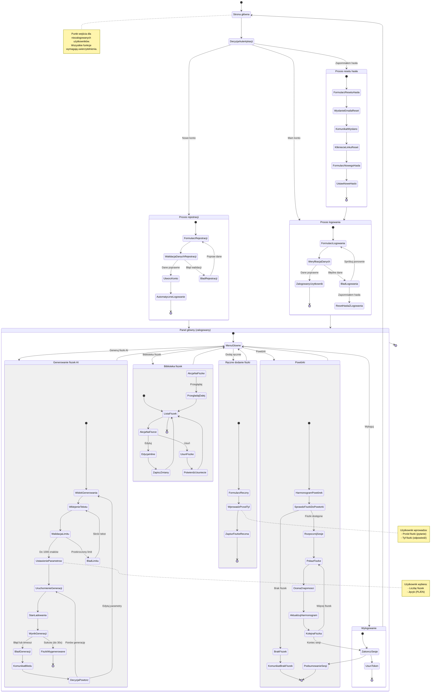

# Diagram podróży użytkownika - 10xCards

Ten diagram przedstawia podróż użytkownika w aplikacji 10xCards, uwzględniając wszystkie kluczowe ścieżki od rejestracji, przez generowanie fiszek, po powtórki.

<mermaid_diagram>

</mermaid_diagram>

## Opis głównych ścieżek

### 1. Autentykacja
- **Rejestracja**: Nowy użytkownik tworzy konto (email + hasło), po walidacji jest automatycznie logowany
- **Logowanie**: Użytkownik z kontem loguje się, po weryfikacji uzyskuje dostęp do aplikacji
- **Reset hasła**: Użytkownik zapomina hasła, otrzymuje email z linkiem, ustawia nowe hasło

### 2. Generowanie fiszek AI
- Użytkownik wkleja tekst (max 1000 znaków)
- Ustawia parametry: liczbę fiszek i język (PL/EN)
- System generuje fiszki w ciągu do 30 sekund
- W przypadku błędu lub timeout'u, użytkownik może ponowić generację

### 3. Zarządzanie fiszkami
- **Przeglądanie**: Lista wszystkich fiszek w bibliotece
- **Edycja inline**: Szybka edycja fiszki bez przechodzenia do osobnego widoku
- **Usuwanie**: Usunięcie fiszki z biblioteki (wpływa na harmonogram)
- **Dodawanie ręczne**: Tworzenie fiszki bez AI (przód/tył)

### 4. Powtórki
- System pokazuje fiszki do powtórki według harmonogramu SRS
- Użytkownik ocenia swoją znajomość fiszki
- Harmonogram aktualizuje się po każdej ocenie
- Sesja kończy się po przeglądnięciu wszystkich zaplanowanych fiszek

### 5. Wylogowanie
- Użytkownik kończy sesję i wraca do strony głównej
- Wszystkie funkcje wymagają ponownego logowania

## Kluczowe punkty decyzyjne

1. **Czy użytkownik ma konto?** → Rejestracja lub logowanie
2. **Czy dane są poprawne?** → Dostęp lub komunikat błędu
3. **Czy tekst w limicie?** → Generowanie lub błąd
4. **Czy generacja udana?** → Fiszki lub retry
5. **Jaką akcję wykonać na fiszce?** → Edycja, usunięcie lub przeglądanie
6. **Czy są fiszki do powtórki?** → Sesja lub komunikat
