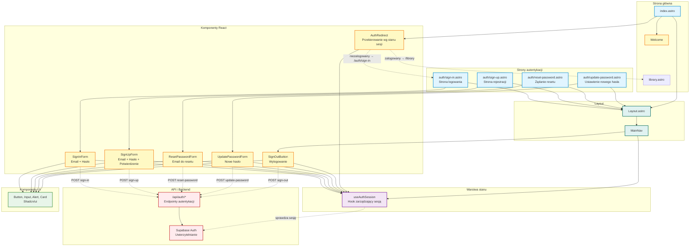

# Diagram modułu autentykacji - 10xCards

Data utworzenia: 2026-01-29

## Opis

Szczegółowy diagram pokazujący architekturę modułu autentykacji, w tym strony, komponenty, przepływ danych i integrację z Supabase Auth.

## Diagram



## Komponenty

### SignInForm
- Pola: Email, Hasło
- Walidacja: Email poprawny, hasło niepuste
- Akcja: POST /api/auth/sign-in
- Po sukcesie: Przekierowanie do /library

### SignUpForm
- Pola: Email, Hasło, Potwierdzenie hasła
- Walidacja: Email poprawny, hasła zgodne, min. długość
- Akcja: POST /api/auth/sign-up
- Po sukcesie: Automatyczne logowanie i przekierowanie

### ResetPasswordForm
- Pola: Email
- Walidacja: Email poprawny
- Akcja: POST /api/auth/reset-password
- Po sukcesie: Wysłanie emaila z linkiem resetu

### UpdatePasswordForm
- Pola: Nowe hasło, Potwierdzenie
- Walidacja: Hasła zgodne, min. długość
- Akcja: POST /api/auth/update-password
- Po sukcesie: Przekierowanie do logowania

### SignOutButton
- Widoczny: W MainNav dla zalogowanych użytkowników
- Akcja: POST /api/auth/sign-out
- Po sukcesie: Przekierowanie do /auth/sign-in

### AuthRedirect
- Używany na: index.astro
- Logika: 
  - Jeśli zalogowany → przekierowanie do /library
  - Jeśli niezalogowany → przekierowanie do /auth/sign-in

## Przepływ autentykacji

### Rejestracja
```
Użytkownik → /auth/sign-up → SignUpForm → 
Wypełnia formularz → POST /api/auth/sign-up → 
Supabase tworzy konto → Automatyczne logowanie → 
Przekierowanie do /library
```

### Logowanie
```
Użytkownik → /auth/sign-in → SignInForm → 
Wypełnia formularz → POST /api/auth/sign-in → 
Supabase weryfikuje dane → Tworzy sesję → 
Przekierowanie do /library
```

### Reset hasła
```
Użytkownik → /auth/reset-password → ResetPasswordForm → 
Podaje email → POST /api/auth/reset-password → 
Supabase wysyła email z linkiem → 
Użytkownik klika link → /auth/update-password → 
UpdatePasswordForm → Ustawia nowe hasło → 
Przekierowanie do /auth/sign-in
```

### Wylogowanie
```
Użytkownik → Klika "Wyloguj" w MainNav → 
SignOutButton → POST /api/auth/sign-out → 
Supabase kończy sesję → Przekierowanie do /auth/sign-in
```

## Hook useAuthSession

Funkcje:
- Sprawdza czy użytkownik jest zalogowany
- Pobiera token dostępu (access_token)
- Monitoruje zmiany stanu sesji
- Udostępnia loading state

Używany przez:
- Wszystkie formularze autentykacji
- MainNav (do pokazania odpowiednich przycisków)
- AuthRedirect (do logiki przekierowania)
- Wszystkie chronione komponenty w innych modułach

## Bezpieczeństwo

- Wszystkie hasła są hashowane przez Supabase
- Tokeny sesji są przechowywane bezpiecznie
- WSZYSTKIE funkcje aplikacji wymagają uwierzytelnienia
- Niezalogowani użytkownicy są przekierowywani na /auth/sign-in
- Reset hasła wymaga potwierdzenia przez email
