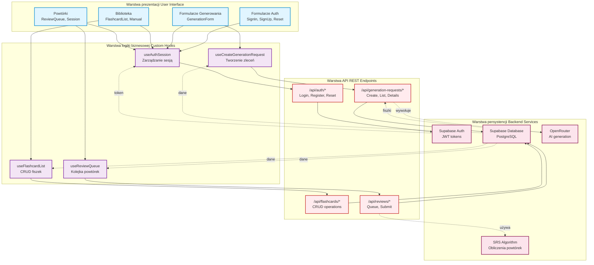
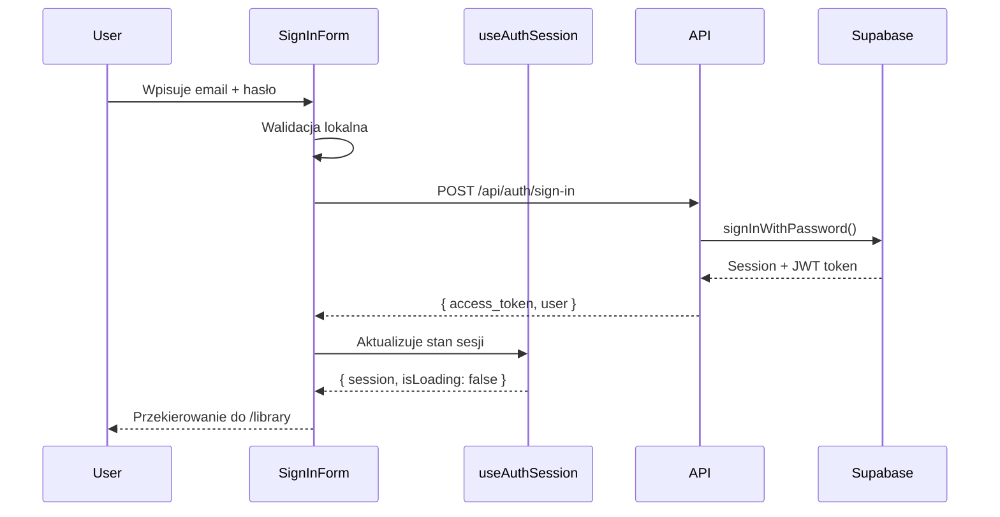
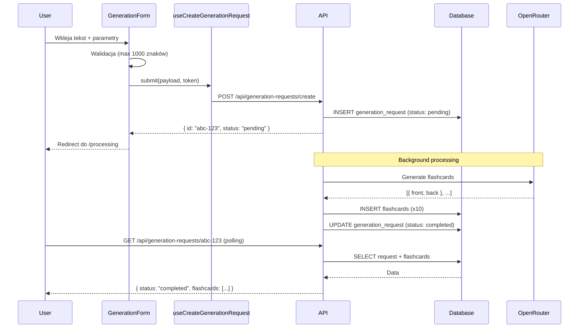
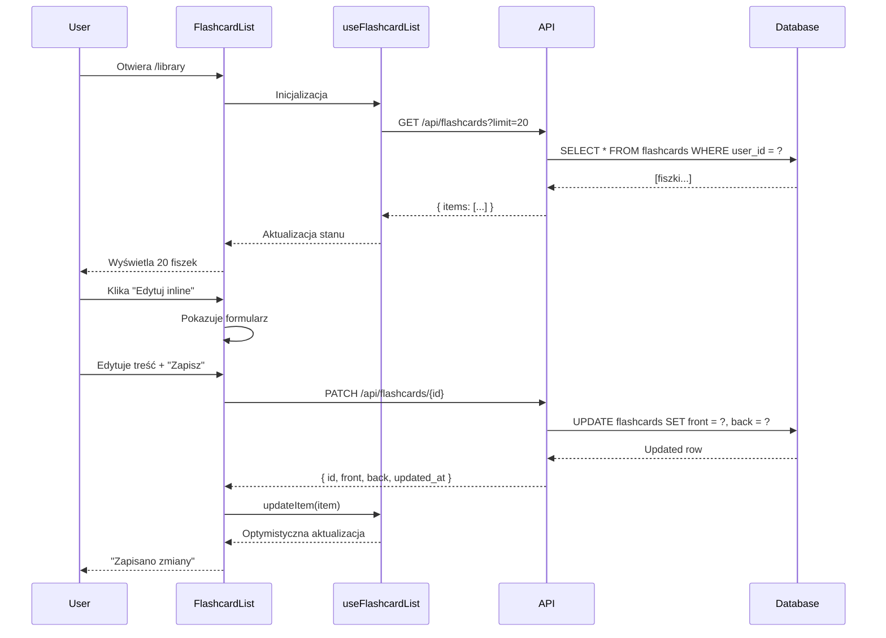
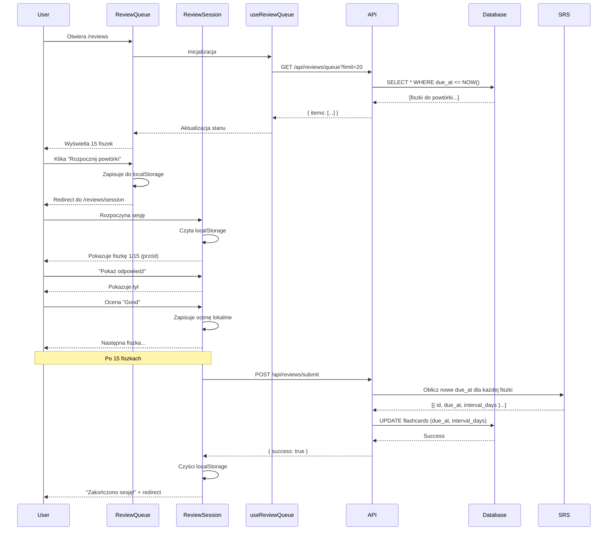

# Diagram przepływu danych - 10xCards

Data utworzenia: 2026-01-29

## Opis

Diagram pokazujący jak dane przepływają przez aplikację od warstwy UI przez hooki, API, aż do backendu i z powrotem. Uproszczony widok architektury danych.

## Diagram



## Szczegółowe przepływy danych

### 1. Autentykacja - Logowanie



### 2. Generowanie fiszek



### 3. Przeglądanie i edycja biblioteki



### 4. System powtórek (SRS)



## Struktura danych

### Session (useAuthSession)

```typescript
{
  access_token: string,
  user: {
    id: string,
    email: string
  },
  expires_at: number
}
```

### FlashcardDTO

```typescript
{
  id: string,
  user_id: string,
  front: string,
  back: string,
  card_type: 'qa' | 'front_back',
  generation_request_id?: string,
  is_manual: boolean,
  due_at: string,
  interval_days: number,
  ease_factor: number,
  repetitions: number,
  last_reviewed_at?: string,
  deleted_at?: string,
  created_at: string,
  updated_at: string
}
```

### GenerationRequestDTO

```typescript
{
  id: string,
  user_id: string,
  source_text: string,
  requested_count: number,
  language: 'PL' | 'EN',
  model?: string,
  status: 'pending' | 'processing' | 'completed' | 'failed',
  error_message?: string,
  created_at: string,
  completed_at?: string,
  flashcards?: FlashcardDTO[]
}
```

### ReviewSubmission

```typescript
{
  reviews: Array<{
    flashcard_id: string,
    rating: 'again' | 'hard' | 'good' | 'easy'
  }>
}
```

## Zarządzanie stanem

### Custom Hooks - wzorzec użycia

Wszystkie hooki używają podobnego wzorca:

```typescript
const useDataHook = (accessToken, query, enabled) => {
  const [data, setData] = useState(null);
  const [error, setError] = useState(null);
  const [isLoading, setIsLoading] = useState(false);
  
  const fetch = async () => {
    if (!enabled || !accessToken) return;
    
    setIsLoading(true);
    try {
      const response = await api.get(endpoint, {
        headers: { Authorization: `Bearer ${accessToken}` }
      });
      setData(response.data);
    } catch (err) {
      setError(err);
    } finally {
      setIsLoading(false);
    }
  };
  
  useEffect(() => {
    fetch();
  }, [accessToken, query, enabled]);
  
  return { data, error, isLoading, refresh: fetch };
};
```

### Optymistyczne aktualizacje

Dla lepszego UX, niektóre operacje aktualizują UI natychmiast:

```typescript
// useFlashcardList
const updateItem = (updatedItem: FlashcardDTO) => {
  // Natychmiastowa aktualizacja UI
  setData(prev => ({
    ...prev,
    items: prev.items.map(item => 
      item.id === updatedItem.id ? updatedItem : item
    )
  }));
  
  // Jeśli API zwróci błąd, można zrobić rollback
};
```

## Bezpieczeństwo danych

### Token przechowywany w Supabase

- JWT token zwracany przez Supabase Auth
- Automatyczne odświeżanie tokenu
- Przechowywany w httpOnly cookies (przez Supabase SDK)

### Autoryzacja requestów

Każdy request do API wymaga tokenu:

```typescript
headers: {
  'Authorization': `Bearer ${accessToken}`,
  'Content-Type': 'application/json'
}
```

### Walidacja na backendzie

1. Sprawdzenie tokenu JWT
2. Weryfikacja user_id
3. Sprawdzenie uprawnień (czy fiszka należy do użytkownika)
4. Walidacja danych wejściowych

## Obsługa błędów

### Standardowe kody błędów

- **401 Unauthorized**: Token nieważny → redirect do /auth/sign-in
- **400 Bad Request**: Nieprawidłowe dane → komunikat inline
- **404 Not Found**: Zasób nie istnieje → refresh listy
- **429 Too Many Requests**: Rate limit → komunikat "Spróbuj później"
- **500 Internal Server Error**: Błąd serwera → komunikat + retry

### Retry strategia

```typescript
const fetchWithRetry = async (fn, maxRetries = 3) => {
  for (let i = 0; i < maxRetries; i++) {
    try {
      return await fn();
    } catch (err) {
      if (i === maxRetries - 1) throw err;
      await sleep(1000 * Math.pow(2, i)); // exponential backoff
    }
  }
};
```

## Optymalizacje wydajności

### Caching

- **Sesja**: Cache w memory (useAuthSession)
- **Kolejka powtórek**: localStorage podczas sesji
- **Lista fiszek**: Cache w hooku, invalidacja po CRUD

### Paginacja

- Load more: 20 fiszek na raz
- Cursor-based pagination dla dużych list
- Lazy loading kolejnych stron

### Debouncing

- Filtry: debounce 300ms przed API call
- Search: debounce 500ms

### Polling optymalizacja

- Generowanie: polling co 2s przez max 30s
- Potem timeout lub success

## Przepływ danych - podsumowanie

1. **UI → Hook**: Interakcja użytkownika wywołuje funkcję hooka
2. **Hook → API**: Hook wysyła HTTP request z tokenem
3. **API → Backend**: API przekazuje do Supabase/OpenRouter
4. **Backend → API**: Backend zwraca dane/status
5. **API → Hook**: Hook aktualizuje stan
6. **Hook → UI**: UI re-renderuje się z nowymi danymi

**Kluczowe zasady:**
- Separation of concerns (UI, logika, API oddzielone)
- Single source of truth (stan w hookach)
- Immutable updates (React state)
- Error handling na każdym poziomie
- Optymistyczne aktualizacje dla lepszego UX
