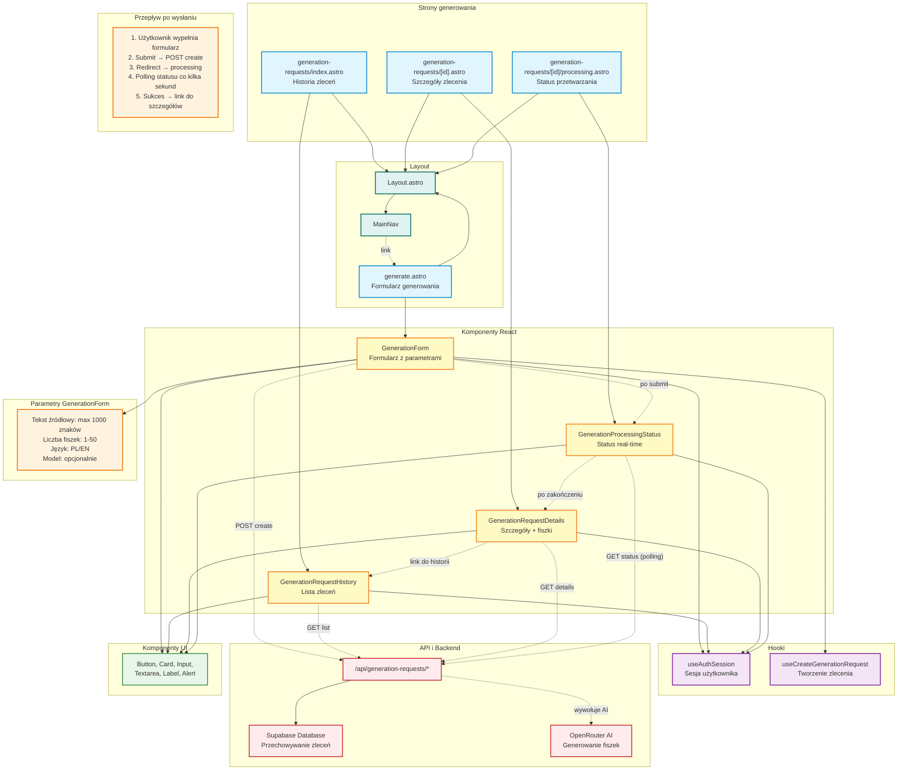

# Diagram modułu generowania fiszek - 10xCards

Data utworzenia: 2026-01-29

## Opis

Szczegółowy diagram pokazujący architekturę modułu generowania fiszek AI, w tym proces od wklejenia tekstu do wygenerowania fiszek.

## Diagram



## Komponenty

### GenerationForm

**Pola:**

- Tekst źródłowy (textarea, max 1000 znaków)
- Liczba fiszek (number, 1-50)
- Język (select, PL/EN)
- Model (input text, opcjonalnie)

**Walidacja:**

- Tekst niepusty i ≤1000 znaków
- Liczba fiszek w zakresie 1-50
- Język wybrany

**Akcja:**

- POST /api/generation-requests/create
- Po sukcesie: przekierowanie do /generation-requests/{id}/processing

**Stan:**

- isSubmitting: pokazuje loader podczas wysyłania
- isRedirecting: komunikat o przekierowaniu

### GenerationRequestHistory

**Funkcje:**

- Wyświetla listę wszystkich zleceń użytkownika
- Sortowanie: najnowsze na górze
- Pokazuje status: pending, processing, completed, failed
- Link do szczegółów każdego zlecenia

**Dane:**

- GET /api/generation-requests/list

### GenerationRequestDetails

**Funkcje:**

- Pokazuje szczegóły zlecenia (tekst źródłowy, parametry)
- Wyświetla wygenerowane fiszki
- Pokazuje logi przetwarzania
- Przycisk "Spróbuj ponownie" dla nieudanych

**Dane:**

- GET /api/generation-requests/{id}

### GenerationProcessingStatus

**Funkcje:**

- Polling statusu co 3-5 sekund
- Pokazuje progress bar lub spinner
- Komunikat o postępie
- Po zakończeniu: przekierowanie do szczegółów lub błąd

**Stany:**

- pending → processing → completed/failed
- Timeout: maksymalnie 30 sekund na generację

## Przepływ generowania

### 1. Wypełnienie formularza

```
Użytkownik → /generate → GenerationForm →
Wkleja tekst (np. definicje medyczne) →
Ustawia liczbę fiszek: 10 →
Wybiera język: PL →
Opcjonalnie: model: gpt-4o-mini
```

### 2. Wysłanie zlecenia

```
Klik "Generuj" → Walidacja pól →
POST /api/generation-requests/create →
Request ID: abc-123 →
Przekierowanie: /generation-requests/abc-123/processing
```

### 3. Przetwarzanie

```
GenerationProcessingStatus →
Polling: GET /api/generation-requests/abc-123/status →
Backend:
  1. Zapisuje zlecenie w DB (status: pending)
  2. Wywołuje OpenRouter AI
  3. AI generuje fiszki (5-30s)
  4. Zapisuje fiszki w DB
  5. Aktualizuje status: completed
```

### 4. Zakończenie

```
Status: completed →
Komunikat: "Wygenerowano 10 fiszek" →
Link: "Zobacz szczegóły" →
Przekierowanie: /generation-requests/abc-123 →
GenerationRequestDetails pokazuje fiszki
```

### 5. Obsługa błędów

```
Status: failed →
Komunikat: "Nie udało się wygenerować" + przyczyna →
Przycisk: "Spróbuj ponownie" →
Retry: POST /api/generation-requests/abc-123/retry
```

## Hook useCreateGenerationRequest

**Funkcje:**

- Wysyła POST request do API
- Zarządza stanem isSubmitting
- Zwraca request ID po sukcesie
- Rzuca błąd w przypadku niepowodzenia

**Użycie:**

```typescript
const { isSubmitting, submit } = useCreateGenerationRequest();

const response = await submit(payload, accessToken);
// response.id = "abc-123"
```

## Integracja z OpenRouter

**Proces:**

1. Backend otrzymuje zlecenie
2. Przygotowuje prompt dla AI:
   - "Wygeneruj 10 fiszek w języku PL z tekstu: {source_text}"
   - Format: JSON z polami front, back, card_type
3. Wywołuje OpenRouter API z modelem (domyślnie: gpt-4o-mini)
4. Parsuje odpowiedź AI
5. Zapisuje fiszki w tabeli flashcards
6. Aktualizuje status zlecenia

**Limity:**

- Max czas: 30 sekund
- Max fiszek: 50
- Max tekst: 1000 znaków

## Walidacja i błędy

**Walidacje formularza:**

- Tekst źródłowy: 1-1000 znaków
- Liczba fiszek: 1-50 (integer)
- Język: tylko PL lub EN

**Możliwe błędy:**

- 401: Nie zalogowany
- 400: Nieprawidłowe dane
- 429: Za dużo requestów
- 500: Błąd serwera
- Timeout: Przekroczono 30s

**Obsługa:**

- Pokazanie komunikatu błędu
- Przycisk "Spróbuj ponownie"
- Zachowanie danych formularza
- Logi błędów w szczegółach zlecenia
