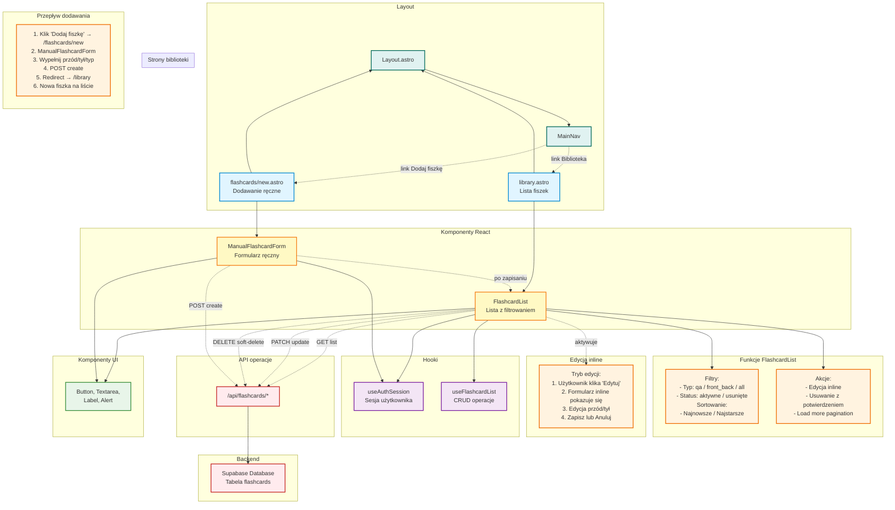

# Diagram modułu biblioteki fiszek - 10xCards

Data utworzenia: 2026-01-29

## Opis

Szczegółowy diagram pokazujący architekturę modułu biblioteki fiszek, w tym przeglądanie, filtrowanie, edycję inline, usuwanie i ręczne dodawanie.

## Diagram



## Komponenty

### FlashcardList

**Funkcje:**

- Wyświetla listę fiszek użytkownika
- Paginacja: "Load more" (domyślnie 20 fiszek)
- Filtrowanie po typie i statusie
- Sortowanie po dacie aktualizacji
- Edycja inline bez opuszczania strony
- Usuwanie z potwierdzeniem (soft delete)

**Filtry:**

- **Typ**:
  - Wszystkie
  - Pytanie i odpowiedź (qa)
  - Przód / tył (front_back)
- **Status**:
  - Aktywne (deleted_at = null)
  - Usunięte (deleted_at != null)

**Sortowanie:**

- Najnowsze (updated_at DESC) - domyślnie
- Najstarsze (updated_at ASC)

**Stan:**

- Ładowanie pierwszych fiszek
- Ładowanie kolejnych (load more)
- Edycja aktywna (tylko jedna fiszka naraz)
- Komunikaty sukcesu/błędu

### Edycja inline

**Przepływ:**

1. Użytkownik klika "Edytuj inline" na fiszce
2. Pola przód/tył zamieniają się na textarea
3. Użytkownik edytuje treść
4. Walidacja na bieżąco (2-2000 znaków)
5. Klik "Zapisz":
   - PATCH /api/flashcards/{id}
   - Aktualizacja na liście
   - Komunikat sukcesu
6. Lub "Anuluj": powrót do trybu wyświetlania

**Zabezpieczenia:**

- Tylko jedna fiszka w trybie edycji naraz
- Pozostałe przyciski "Edytuj" zablokowane
- Ostrzeżenie przy próbie edycji innej fiszki z niezapisanymi zmianami
- Nie można edytować usuniętych fiszek

### Usuwanie fiszki

**Przepływ:**

1. Użytkownik klika "Usuń"
2. Dialog potwierdzenia:
   - "Czy na pewno chcesz usunąć tę fiszkę?"
   - "Tej operacji nie można cofnąć"
3. Klik "Usuń":
   - DELETE /api/flashcards/{id}
   - Soft delete (updated deleted_at)
   - Usunięcie z listy
   - Komunikat sukcesu
4. Lub "Anuluj": zamknięcie dialogu

**Soft delete:**

- Fiszka nie jest fizycznie usuwana
- Ustawiane jest pole deleted_at
- Fiszka nie pojawia się w domyślnym widoku
- Widoczna w filtrze "Usunięte"
- Nie pojawia się w powtórkach

### ManualFlashcardForm

**Pola:**

- Przód (textarea, 2-2000 znaków)
- Tył (textarea, 2-2000 znaków)
- Typ fiszki (select):
  - Przód / tył (front_back) - domyślnie
  - Pytanie i odpowiedź (qa)

**Walidacja:**

- Przód: min 2, max 2000 znaków
- Tył: min 2, max 2000 znaków
- Walidacja na blur i przed wysłaniem

**Akcja:**

- POST /api/flashcards/create
- Po sukcesie:
  - Komunikat "Fiszka została dodana"
  - Automatyczne przekierowanie do /library po 1.5s
  - Nowa fiszka pojawia się na liście

**Stan:**

- isSubmitting: pokazuje loader podczas zapisu

## Hook useFlashcardList

**Funkcje:**

- Pobiera listę fiszek z API
- Zarządza stanem listy (items, loading, error)
- Obsługuje paginację (load more)
- Optymistyczne aktualizacje UI
- CRUD operations: create, update, delete

**API:**

```typescript
const {
  data, // { items: FlashcardDTO[] }
  error, // { message: string, status: number }
  isLoading, // boolean
  hasMore, // boolean
  refresh, // () => void
  loadMore, // () => void
  addItem, // (item: FlashcardDTO) => void
  updateItem, // (item: FlashcardDTO) => void
  removeItem, // (id: string) => void
} = useFlashcardList(accessToken, query, enabled);
```

**Query params:**

```typescript
{
  limit?: number,      // domyślnie 20
  sort?: FlashcardSort,     // "-updated_at" | "updated_at"
  type?: FlashcardTypeFilter,     // "qa" | "front_back"
  deleted?: FlashcardDeletedFilter  // boolean
}
```

## Przepływy użytkownika

### 1. Przeglądanie biblioteki

```
Użytkownik → /library → FlashcardList →
Załadowanie 20 fiszek →
Przewijanie w dół →
Klik "Załaduj więcej" →
Załadowanie kolejnych 20 fiszek
```

### 2. Filtrowanie fiszek

```
Użytkownik → Wybiera filtr "Pytanie i odpowiedź" →
Lista odświeża się →
Pokazane tylko fiszki typu qa →
Wybiera sortowanie "Najstarsze" →
Lista posortowana ASC
```

### 3. Edycja inline

```
Użytkownik → Klika "Edytuj inline" →
Textarea pokazują się z treścią →
Edytuje przód: "Czym jest mitochondrium?" →
Edytuje tył: "Organellum komórkowe..." →
Klik "Zapisz" →
PATCH /api/flashcards/{id} →
Lista aktualizuje się →
Komunikat: "Zapisano zmiany"
```

### 4. Usuwanie fiszki

```
Użytkownik → Klika "Usuń" →
Dialog potwierdzenia →
Klik "Usuń" w dialogu →
DELETE /api/flashcards/{id} →
Fiszka znika z listy →
Komunikat: "Fiszka została usunięta"
```

### 5. Ręczne dodawanie

```
Użytkownik → Klika "Dodaj fiszkę" w MainNav →
Przekierowanie: /flashcards/new →
ManualFlashcardForm →
Wypełnia:
  Przód: "Co to jest RNA?"
  Tył: "Kwas rybonukleinowy..."
  Typ: "Pytanie i odpowiedź"
Klik "Dodaj fiszkę" →
POST /api/flashcards/create →
Komunikat: "Fiszka została dodana" →
Przekierowanie: /library →
Nowa fiszka na górze listy
```

## Walidacja i błędy

**Walidacje:**

- Przód/Tył: 2-2000 znaków (trim)
- Typ fiszki: tylko "qa" lub "front_back"
- Użytkownik zalogowany

**Możliwe błędy:**

- 401: Nie zalogowany → przekierowanie do /auth/sign-in
- 400: Nieprawidłowe dane → komunikat inline
- 404: Fiszka nie znaleziona → refresh listy
- 500: Błąd serwera → komunikat + przycisk retry

**Komunikaty sukcesu:**

- "Zapisano zmiany" - po edycji
- "Fiszka została usunięta" - po usunięciu
- "Fiszka została dodana" - po utworzeniu
- "Dodano fiszkę, ale nie spełnia aktywnych filtrów" - gdy nowa fiszka poza filtrem

## Optymalizacje

**Optymistyczne aktualizacje:**

- Lista aktualizuje się natychmiast
- W przypadku błędu: rollback i komunikat

**Infinite scroll:**

- Load more zamiast tradycyjnej paginacji
- Ładowanie kolejnych 20 fiszek
- Przycisk "Załaduj więcej" zamiast auto-load

**Zarządzanie stanem edycji:**

- Tylko jedna fiszka w trybie edycji
- Ostrzeżenie o niezapisanych zmianach
- URL parameter ?edit={id} dla deep linking
