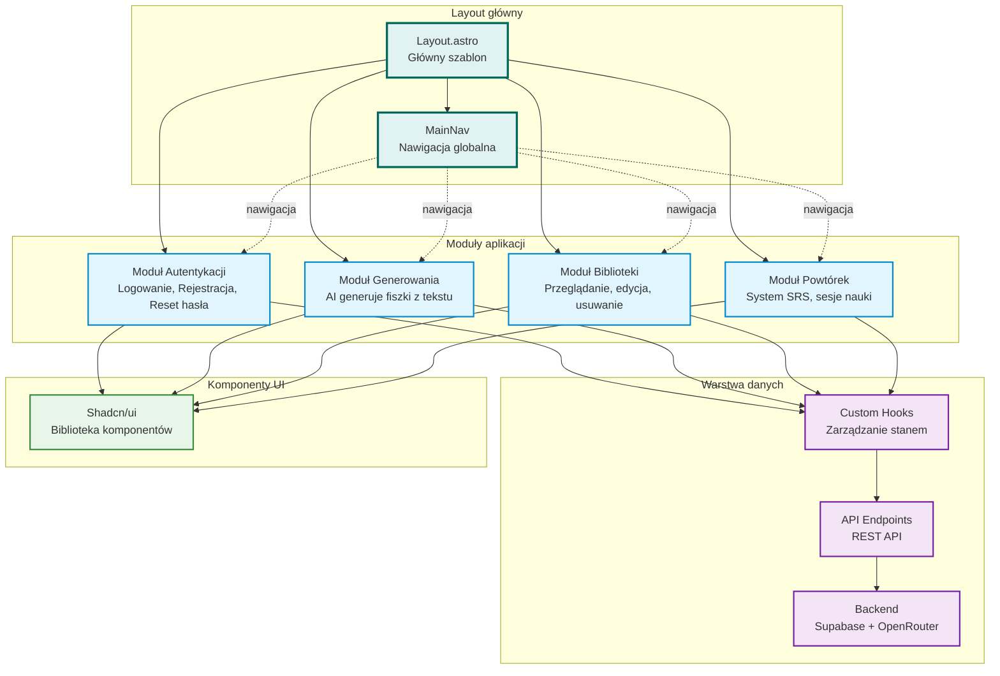

# Diagram przeglądu architektury UI - 10xCards

Data utworzenia: 2026-01-29

## Opis

Wysokopoziomowy diagram pokazujący główne moduły aplikacji, ich relacje i przepływ nawigacji między stronami.

## Diagram

## Struktura modułów

### Moduł Autentykacji
- Strony: sign-in, sign-up, reset-password, update-password
- Komponenty: SignInForm, SignUpForm, ResetPasswordForm, UpdatePasswordForm, SignOutButton
- Funkcje: Logowanie, rejestracja, reset hasła, wylogowanie

### Moduł Generowania Fiszek
- Strony: generate, generation-requests/*, processing
- Komponenty: GenerationForm, GenerationRequestHistory, GenerationRequestDetails, GenerationProcessingStatus
- Funkcje: Generowanie fiszek AI z tekstu źródłowego, historia zleceń

### Moduł Biblioteki
- Strony: library, flashcards/new
- Komponenty: FlashcardList, ManualFlashcardForm
- Funkcje: Przeglądanie, filtrowanie, sortowanie, edycja inline, usuwanie, dodawanie ręczne

### Moduł Powtórek
- Strony: reviews, reviews/session
- Komponenty: ReviewQueue, ReviewSession
- Funkcje: Kolejka powtórek według harmonogramu SRS, sesje nauki

## Przepływ użytkownika

1. **Niezalogowany użytkownik** → Logowanie/Rejestracja
2. **Zalogowany użytkownik** → Strona główna przekierowuje do Biblioteki
3. **Generowanie** → Użytkownik wkleja tekst → AI generuje fiszki → Fiszki trafiają do biblioteki
4. **Biblioteka** → Użytkownik przegląda, edytuje, usuwa fiszki
5. **Powtórki** → System pokazuje fiszki gotowe do powtórki → Użytkownik ocenia → Harmonogram aktualizuje się

## Technologie

- **Frontend**: Astro 5 + React 19 + TypeScript 5
- **Styling**: Tailwind 4 + Shadcn/ui
- **Backend**: Supabase (Auth + Database)
- **AI**: OpenRouter
- **Architektura**: Islands Architecture (Astro)
