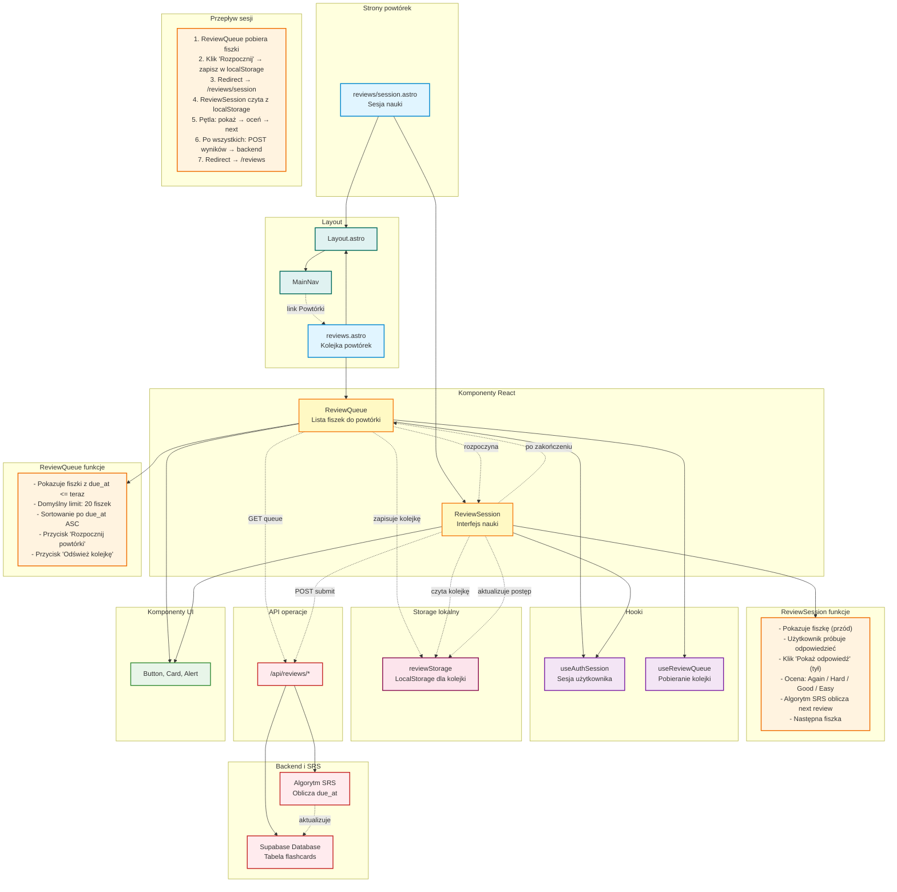

# Diagram modułu powtórek - 10xCards

Data utworzenia: 2026-01-29

## Opis

Szczegółowy diagram pokazujący architekturę modułu powtórek z systemem SRS (Spaced Repetition System), kolejką powtórek i sesjami nauki.

## Diagram



## Komponenty

### ReviewQueue

**Funkcje:**

- Pobiera kolejkę fiszek gotowych do powtórki
- Wyświetla listę z informacjami (termin, przód, tył)
- Przycisk "Rozpocznij powtórki" (aktywny gdy są fiszki)
- Przycisk "Odśwież kolejkę" (refresh danych)
- Licznik fiszek do powtórki

**Kryteria kolejki:**

- `due_at <= NOW()` - fiszki z terminem w przeszłości lub teraz
- `deleted_at IS NULL` - tylko aktywne fiszki
- Sortowanie: `due_at ASC` - najstarsze terminy pierwsze
- Limit: 20 fiszek (domyślnie)

**Stan:**

- isLoading: podczas pobierania
- items: lista fiszek
- error: błąd podczas pobierania

**Akcje:**

1. **Rozpocznij powtórki:**
   - Zapisuje kolejkę do localStorage
   - Przekierowuje do /reviews/session
2. **Odśwież kolejkę:**
   - Ponownie pobiera dane z API
   - Aktualizuje listę

### ReviewSession

**Interfejs nauki:**

1. **Widok karty (przód):**
   - Pokazuje przód fiszki
   - Licznik: "Fiszka 1/20"
   - Przycisk: "Pokaż odpowiedź"

2. **Widok odpowiedzi (tył):**
   - Pokazuje przód + tył
   - 4 przyciski oceny:
     - **Again** - nie pamiętam (interval: 1 min)
     - **Hard** - trudno (interval: krótszy)
     - **Good** - dobrze (interval: standardowy)
     - **Easy** - łatwo (interval: dłuższy)

3. **Postęp sesji:**
   - Progress bar: "5/20 fiszek"
   - Liczniki: Again: 2, Hard: 1, Good: 2, Easy: 0

4. **Zakończenie sesji:**
   - Podsumowanie wyników
   - POST /api/reviews/submit (wszystkie oceny)
   - Komunikat: "Świetna robota! Powtórzyłeś 20 fiszek"
   - Przycisk: "Wróć do kolejki"

**Stan lokalny:**

- currentIndex: aktualna fiszka (0-19)
- showAnswer: czy pokazać tył
- reviews: tablica ocen dla każdej fiszki
- isCompleted: czy sesja zakończona
- isSubmitting: czy wysyłanie wyników

**localStorage:**

- Klucz: "review-queue"
- Wartość: JSON z listą fiszek
- Czyszczony po zakończeniu sesji

## Hook useReviewQueue

**Funkcje:**

- Pobiera kolejkę fiszek do powtórki
- Zarządza stanem (loading, error, data)
- Obsługuje refresh

**API:**

```typescript
const {
  data, // { items: FlashcardDTO[] }
  error, // { message: string, status: number }
  isLoading, // boolean
  refresh, // () => void
} = useReviewQueue(accessToken, query, enabled);
```

**Query params:**

```typescript
{
  limit?: number  // domyślnie 20
}
```

## Algorytm SRS

### Interwały powtórek (uproszczone)

**Pierwsza powtórka:**

- Again: 1 minuta
- Hard: 10 minut
- Good: 1 dzień
- Easy: 4 dni

**Kolejne powtórki** (mnożniki):

- Again: interval × 0.5 (reset)
- Hard: interval × 1.2
- Good: interval × 2.5
- Easy: interval × 3.0

**Przykład:**

```
Fiszka nowa → Good → due_at = now + 1 dzień
Po 1 dniu → Good → due_at = now + 2.5 dnia
Po 2.5 dnia → Easy → due_at = now + 7.5 dnia
Po 7.5 dnia → Again → due_at = now + 3.75 dnia (reset)
```

### Pola w bazie danych

```sql
flashcards:
  - due_at: timestamp (kiedy następna powtórka)
  - interval_days: float (aktualny interwał w dniach)
  - ease_factor: float (mnożnik trudności)
  - repetitions: integer (liczba udanych powtórek)
  - last_reviewed_at: timestamp
```

## Przepływy użytkownika

### 1. Sprawdzenie kolejki

```
Użytkownik → /reviews → ReviewQueue →
GET /api/reviews/queue →
Backend sprawdza: due_at <= NOW() →
Zwraca 15 fiszek →
Lista pokazuje fiszki z terminami
```

### 2. Rozpoczęcie sesji

```
Użytkownik → Klik "Rozpocznij powtórki" →
ReviewQueue zapisuje listę do localStorage →
Redirect → /reviews/session →
ReviewSession czyta localStorage →
Pokazuje pierwszą fiszkę (przód)
```

### 3. Proces nauki

```
Użytkownik widzi przód: "Czym jest mitochondrium?" →
Myśli o odpowiedzi →
Klik "Pokaż odpowiedź" →
Widzi tył: "Organellum komórkowe produkujące ATP..." →
Ocenia: "Good" →

Backend (po sesji):
  - interval_days = 1 dzień × 2.5 = 2.5 dnia
  - due_at = now + 2.5 dnia
  - repetitions += 1
  - last_reviewed_at = now

Następna fiszka...
```

### 4. Zakończenie sesji

```
Ostatnia fiszka oceniona →
Podsumowanie:
  - Again: 3
  - Hard: 2
  - Good: 10
  - Easy: 5
Klik "Wyślij wyniki" →
POST /api/reviews/submit z tablicą ocen →
Backend aktualizuje wszystkie fiszki (due_at) →
Komunikat sukcesu →
Klik "Wróć do kolejki" →
Redirect → /reviews
```

### 5. Pusta kolejka

```
Użytkownik → /reviews → ReviewQueue →
GET /api/reviews/queue →
Brak fiszek do powtórki →
Komunikat: "Brak fiszek do powtórek. Wróć później lub dodaj nowe."
```

## Zarządzanie stanem sesji

### localStorage (reviewStorage)

**Zapisywane dane:**

```typescript
{
  queue: FlashcardDTO[],    // lista fiszek do powtórki
  startedAt: string,         // timestamp rozpoczęcia
  reviews: {                 // oceny dla każdej fiszki
    [flashcardId: string]: 'again' | 'hard' | 'good' | 'easy'
  }
}
```

**Funkcje pomocnicze:**

```typescript
writeReviewQueue(items: FlashcardDTO[])  // zapisz kolejkę
readReviewQueue()                         // odczytaj kolejkę
clearReviewQueue()                        // wyczyść po zakończeniu
```

**Bezpieczeństwo:**

- Dane w localStorage są tymczasowe
- Czyszczone po zakończeniu sesji
- Nie zawierają wrażliwych danych (tylko ID i treść fiszek)

## API Endpoints

### GET /api/reviews/queue

**Request:**

```
Headers: Authorization: Bearer {token}
Query: ?limit=20
```

**Response:**

```json
{
  "items": [
    {
      "id": "uuid",
      "front": "Czym jest mitochondrium?",
      "back": "Organellum...",
      "card_type": "qa",
      "due_at": "2026-01-29T10:00:00Z",
      "interval_days": 1.0,
      ...
    }
  ]
}
```

### POST /api/reviews/submit

**Request:**

```json
{
  "reviews": [
    {
      "flashcard_id": "uuid-1",
      "rating": "good"
    },
    {
      "flashcard_id": "uuid-2",
      "rating": "easy"
    }
  ]
}
```

**Response:**

```json
{
  "success": true,
  "updated_count": 20
}
```

## Walidacja i błędy

**Walidacje:**

- Użytkownik zalogowany
- Kolejka niepusta (dla rozpoczęcia sesji)
- Rating w zakresie: again, hard, good, easy
- flashcard_id istnieje i należy do użytkownika

**Możliwe błędy:**

- 401: Nie zalogowany → redirect /auth/sign-in
- 400: Nieprawidłowe dane → komunikat
- 404: Fiszka nie znaleziona → pomiń
- 500: Błąd serwera → komunikat + retry

**Komunikaty:**

- "Brak fiszek do powtórek" - pusta kolejka
- "Sesja zakończona! Powtórzyłeś X fiszek" - sukces
- "Nie udało się wysłać wyników" - błąd submit

## Optymalizacje i UX

**Keyboard shortcuts (opcjonalnie):**

- Space: Pokaż odpowiedź
- 1: Again
- 2: Hard
- 3: Good
- 4: Easy

**Progres tracking:**

- Visual progress bar
- Liczniki ocen na żywo
- Pozostało fiszek: "5/20"

**Offline capability:**

- Kolejka zapisana w localStorage
- Sesja działa offline
- Wyniki wysyłane po powrocie online

**Motywacja:**

- Streak tracking (dni z rzędu)
- Statystyki: fiszki dziennie, tygodniowo
- Gratulacje po zakończeniu sesji
