# Architektura UI - 10xCards

Data utworzenia: 2026-01-29
Data aktualizacji: 2026-01-29

> **Uwaga**: Ten plik zawiera pełny diagram architektury UI. Ze względu na złożoność został podzielony na 6 mniejszych, bardziej czytelnych diagramów. Zalecamy przeglądanie mniejszych diagramów:
>
> - **[Diagram przeglądu](./ui-overview.md)** - Wysokopoziomowy widok modułów
> - **[Moduł autentykacji](./ui-auth.md)** - Logowanie, rejestracja, reset hasła
> - **[Moduł generowania](./ui-generation.md)** - Generowanie fiszek AI
> - **[Moduł biblioteki](./ui-library.md)** - Przeglądanie, edycja, usuwanie fiszek
> - **[Moduł powtórek](./ui-reviews.md)** - System SRS, sesje nauki
> - **[Przepływ danych](./ui-data-flow.md)** - Jak dane przepływają przez aplikację

## Przegląd

Ten diagram (poniżej) przedstawia pełną architekturę interfejsu użytkownika aplikacji 10xCards, w tym:

- Strukturę stron Astro (server-side)
- Komponenty React (client-side)
- Custom Hooks do zarządzania stanem
- Komponenty UI z biblioteki Shadcn/ui
- Przepływ danych między warstwami
- Integracje z API i backendem

## Legenda kolorów

- **Turkusowy** - Layout główny (Layout.astro, MainNav)
- **Niebieski** - Strony Astro (server pages)
- **Żółty** - Komponenty React (client-side)
- **Fioletowy** - Custom Hooks (zarządzanie stanem)
- **Zielony** - Komponenty UI (Shadcn/ui)
- **Czerwony** - Endpointy API
- **Różowy** - Backend i zewnętrzne usługi

## Diagram Mermaid

```mermaid
flowchart TD
    subgraph "Layout główny"
        LA["Layout.astro"]
        MN["MainNav"]
        LA --> MN
    end

    subgraph "Moduł Autentykacji"
        SI["auth/sign-in.astro"]
        SU["auth/sign-up.astro"]
        RP["auth/reset-password.astro"]
        UP["auth/update-password.astro"]

        SIF[SignInForm]
        SUF[SignUpForm]
        RPF[ResetPasswordForm]
        UPF[UpdatePasswordForm]
        SOB[SignOutButton]
        AR[AuthRedirect]

        SI --> LA
        SU --> LA
        RP --> LA
        UP --> LA

        SI --> SIF
        SU --> SUF
        RP --> RPF
        UP --> UPF

        MN --> SOB
    end

    subgraph "Moduł Generowania Fiszek"
        GP["generate.astro"]
        GRI["generation-requests/index.astro"]
        GRID["generation-requests/[id].astro"]
        GRIP["generation-requests/[id]/processing.astro"]

        GF[GenerationForm]
        GRH[GenerationRequestHistory]
        GRD[GenerationRequestDetails]
        GPS[GenerationProcessingStatus]

        GP --> LA
        GRI --> LA
        GRID --> LA
        GRIP --> LA

        GP --> GF
        GRI --> GRH
        GRID --> GRD
        GRIP --> GPS

        GF -.tworzy zlecenie.-> GRH
        GRH -.przechodzi do szczegółów.-> GRD
        GF -.przekierowuje do.-> GPS
    end

    subgraph "Moduł Biblioteki Fiszek"
        LP["library.astro"]
        FNP["flashcards/new.astro"]

        FL[FlashcardList]
        MFF[ManualFlashcardForm]

        LP --> LA
        FNP --> LA

        LP --> FL
        FNP --> MFF

        MFF -.dodaje fiszkę.-> FL
        FL -.link do dodania.-> MFF
    end

    subgraph "Moduł Powtórek"
        RV["reviews.astro"]
        RS["reviews/session.astro"]

        RQ[ReviewQueue]
        RSC[ReviewSession]

        RV --> LA
        RS --> LA

        RV --> RQ
        RS --> RSC

        RQ -.rozpoczyna sesję.-> RSC
    end

    subgraph "Strona główna"
        IP["index.astro"]
        WC["Welcome"]

        IP --> LA
        IP --> AR
        IP --> WC
    end

    subgraph "Custom Hooks Zarządzanie stanem"
        UAS[useAuthSession]
        UCGR[useCreateGenerationRequest]
        UFL[useFlashcardList]
        URQ[useReviewQueue]

        SIF --> UAS
        SUF --> UAS
        RPF --> UAS
        UPF --> UAS
        MN --> UAS
        AR --> UAS

        GF --> UAS
        GF --> UCGR
        GRH --> UAS
        GRD --> UAS
        GPS --> UAS

        FL --> UAS
        FL --> UFL
        MFF --> UAS

        RQ --> UAS
        RQ --> URQ
        RSC --> UAS
    end

    subgraph "Komponenty UI Shadcn/ui"
        BTN[Button]
        CRD[Card]
        INP[Input]
        TXT[Textarea]
        LBL[Label]
        ALT[Alert]
        AVT[Avatar]
        SEP[Separator]

        SIF --> BTN
        SIF --> INP
        SIF --> ALT

        SUF --> BTN
        SUF --> INP
        SUF --> ALT

        GF --> BTN
        GF --> TXT
        GF --> CRD
        GF --> INP
        GF --> LBL

        FL --> BTN
        FL --> TXT
        FL --> ALT

        MFF --> BTN
        MFF --> TXT
        MFF --> LBL
        MFF --> ALT

        RQ --> BTN
        RQ --> CRD
        RQ --> ALT
    end

    subgraph "API Endpoints"
        API_AUTH["/api/auth/*"]
        API_GEN["/api/generation-requests/*"]
        API_FLASH["/api/flashcards/*"]
        API_REV["/api/reviews/*"]

        SIF -.POST.-> API_AUTH
        SUF -.POST.-> API_AUTH
        RPF -.POST.-> API_AUTH
        SOB -.POST.-> API_AUTH

        GF -.POST.-> API_GEN
        GRH -.GET.-> API_GEN
        GRD -.GET.-> API_GEN
        GPS -.GET.-> API_GEN

        FL -.GET PATCH DELETE.-> API_FLASH
        MFF -.POST.-> API_FLASH

        RQ -.GET.-> API_REV
        RSC -.POST.-> API_REV
    end

    subgraph "Supabase Backend"
        SB_AUTH["Supabase Auth"]
        SB_DB["Supabase Database"]

        API_AUTH --> SB_AUTH
        API_GEN --> SB_DB
        API_FLASH --> SB_DB
        API_REV --> SB_DB

        UAS -.sprawdza sesję.-> SB_AUTH
    end

    subgraph "Zewnętrzne usługi"
        AI_SERVICE["OpenRouter AI Service"]

        API_GEN -.generuje fiszki.-> AI_SERVICE
    end

    classDef pageCls fill:#e1f5ff,stroke:#0288d1,stroke-width:2px
    classDef componentCls fill:#fff9c4,stroke:#f57f17,stroke-width:2px
    classDef hookCls fill:#f3e5f5,stroke:#7b1fa2,stroke-width:2px
    classDef uiCls fill:#e8f5e9,stroke:#388e3c,stroke-width:2px
    classDef apiCls fill:#ffebee,stroke:#c62828,stroke-width:2px
    classDef backendCls fill:#fce4ec,stroke:#880e4f,stroke-width:2px
    classDef layoutCls fill:#e0f2f1,stroke:#00695c,stroke-width:3px

    class LA,MN layoutCls
    class SI,SU,RP,UP,GP,GRI,GRID,GRIP,LP,FNP,RV,RS,IP pageCls
    class SIF,SUF,RPF,UPF,SOB,AR,GF,GRH,GRD,GPS,FL,MFF,RQ,RSC,WC componentCls
    class UAS,UCGR,UFL,URQ hookCls
    class BTN,CRD,INP,TXT,LBL,ALT,AVT,SEP uiCls
    class API_AUTH,API_GEN,API_FLASH,API_REV apiCls
    class SB_AUTH,SB_DB,AI_SERVICE backendCls
```



## Opis głównych modułów

### 1. Layout główny

- **Layout.astro** - Główny szablon aplikacji zawierający nawigację i slot dla treści
- **MainNav** - Komponent nawigacji z linkami do głównych sekcji i kontrolkami autentykacji

### 2. Moduł Autentykacji

Strony:

- `auth/sign-in.astro` - Logowanie użytkownika
- `auth/sign-up.astro` - Rejestracja nowego konta
- `auth/reset-password.astro` - Żądanie resetu hasła
- `auth/update-password.astro` - Ustawienie nowego hasła

Komponenty:

- **SignInForm** - Formularz logowania (email + hasło)
- **SignUpForm** - Formularz rejestracji (email + hasło + potwierdzenie)
- **ResetPasswordForm** - Formularz żądania linku do resetu hasła
- **UpdatePasswordForm** - Formularz ustawienia nowego hasła
- **SignOutButton** - Przycisk wylogowania dostępny w nawigacji
- **AuthRedirect** - Komponent przekierowujący zalogowanych użytkowników ze strony głównej

### 3. Moduł Generowania Fiszek

Strony:

- `generate.astro` - Formularz generowania fiszek AI
- `generation-requests/index.astro` - Historia wszystkich zleceń generacji
- `generation-requests/[id].astro` - Szczegóły pojedynczego zlecenia
- `generation-requests/[id]/processing.astro` - Status przetwarzania zlecenia w czasie rzeczywistym

Komponenty:

- **GenerationForm** - Formularz z polami: tekst źródłowy (max 1000 znaków), liczba fiszek (1-50), język (PL/EN), model (opcjonalnie)
- **GenerationRequestHistory** - Lista historycznych zleceń z ich statusami
- **GenerationRequestDetails** - Szczegóły pojedynczego zlecenia i wygenerowane fiszki
- **GenerationProcessingStatus** - Komponent pokazujący status przetwarzania zlecenia (ładowanie, sukces, błąd)

Przepływ:

1. Użytkownik wypełnia formularz w GenerationForm
2. Po wysłaniu przekierowanie na stronę processing
3. GenerationProcessingStatus odpytuje API o status
4. Po zakończeniu użytkownik może przejść do szczegółów zlecenia

### 4. Moduł Biblioteki Fiszek

Strony:

- `library.astro` - Lista wszystkich fiszek z filtrowaniem i edycją
- `flashcards/new.astro` - Formularz ręcznego dodawania fiszki

Komponenty:

- **FlashcardList** - Zaawansowany komponent listy z:
  - Filtrowaniem po typie (qa/front_back) i statusie (aktywne/usunięte)
  - Sortowaniem (najnowsze/najstarsze)
  - Edycją inline (przód i tył)
  - Usuwaniem z potwierdzeniem
  - Nieskończonym scrollem (load more)
- **ManualFlashcardForm** - Formularz ręcznego dodawania fiszki (przód, tył, typ)

Przepływ:

1. Użytkownik widzi listę swoich fiszek
2. Może filtrować, sortować, edytować inline lub usuwać
3. Link do dodania nowej fiszki przekierowuje na formularz
4. Po zapisaniu powrót do biblioteki

### 5. Moduł Powtórek

Strony:

- `reviews.astro` - Kolejka fiszek gotowych do powtórki
- `reviews/session.astro` - Interfejs sesji powtórek

Komponenty:

- **ReviewQueue** - Pokazuje fiszki gotowe do powtórki zgodnie z harmonogramem SRS
- **ReviewSession** - Interfejs do przeprowadzania sesji powtórek (pokazywanie fiszki, ocena, następna fiszka)

Przepływ:

1. Użytkownik widzi kolejkę fiszek do powtórki
2. Rozpoczyna sesję klikając przycisk
3. W sesji ocenia każdą fiszkę
4. Po zakończeniu harmonogram zostaje zaktualizowany

### 6. Strona główna

- **index.astro** - Strona główna aplikacji
- **AuthRedirect** - Przekierowuje zalogowanych na `/library`, niezalogowanych na `/auth/sign-in`
- **Welcome** - Komponent powitalny (prawdopodobnie dla niezalogowanych)

### 7. Custom Hooks

- **useAuthSession** - Zarządza sesją użytkownika (sprawdzanie, pobieranie tokenu)
- **useCreateGenerationRequest** - Hook do tworzenia zlecenia generacji
- **useFlashcardList** - Hook do pobierania i zarządzania listą fiszek (CRUD operations)
- **useReviewQueue** - Hook do pobierania kolejki fiszek do powtórek

### 8. Komponenty UI (Shadcn/ui)

Współdzielone komponenty interfejsu:

- **Button** - Przyciski w różnych wariantach
- **Card** - Karty z nagłówkiem, treścią i stopką
- **Input** - Pola tekstowe
- **Textarea** - Obszary tekstowe
- **Label** - Etykiety formularzy
- **Alert** - Banery alertów (sukces, błąd, info)
- **Avatar** - Awatar użytkownika
- **Separator** - Separatory wizualne

## Przepływ danych

### Autentykacja

```
Formularz → POST /api/auth/* → Supabase Auth → Session → useAuthSession → Komponenty
```

### Generowanie fiszek

```
GenerationForm → POST /api/generation-requests/* → Supabase DB + OpenRouter AI →
Zlecenie → GenerationProcessingStatus (polling) → Wygenerowane fiszki
```

### Biblioteka fiszek

```
FlashcardList → GET /api/flashcards/* → Supabase DB → Fiszki →
Edycja → PATCH /api/flashcards/[id] → Aktualizacja →
Usuwanie → DELETE /api/flashcards/[id] → Soft delete
```

### Powtórki

```
ReviewQueue → GET /api/reviews/* → Supabase DB → Fiszki do powtórki →
ReviewSession → POST /api/reviews/* → Aktualizacja harmonogramu SRS
```

## Kluczowe wzorce architektoniczne

1. **Server-Side Rendering (SSR)** - Strony Astro renderowane na serwerze
2. **Islands Architecture** - Komponenty React hydratowane tylko tam, gdzie potrzebna interaktywność (client:load)
3. **Separation of Concerns** - Wyraźny podział na strony (Astro), logikę (hooks), UI (komponenty)
4. **Optimistic UI Updates** - Natychmiastowa aktualizacja UI przed potwierdzeniem z serwera (np. w FlashcardList)
5. **Progressive Enhancement** - Podstawowa funkcjonalność działa bez JS, interaktywność dodana progresywnie

## Uwagi implementacyjne

- Wszystkie funkcje wymagają uwierzytelnienia (zgodnie z PRD)
- Używamy Supabase do autentykacji i bazy danych
- Generowanie AI przez OpenRouter
- Komponenty UI z Shadcn/ui dla spójności designu
- Custom hooks enkapsulują logikę biznesową i zarządzanie stanem
- Formularze z pełną walidacją po stronie klienta i serwera
- Obsługa błędów na każdym poziomie aplikacji
